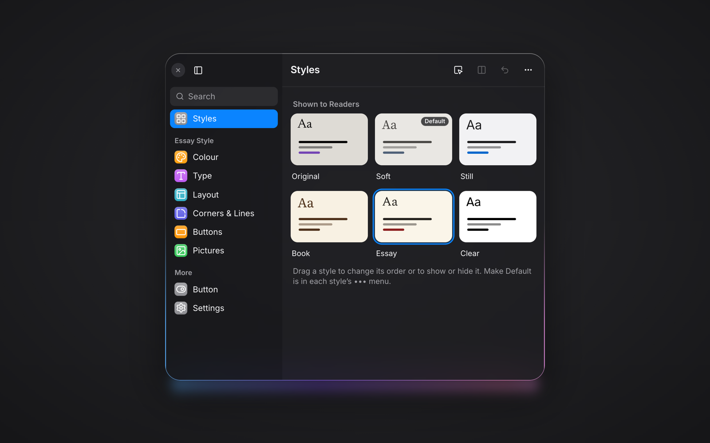

# Vibetiles

A design panel built for AI. Tell your AI how your site should feel, and it styles the live page while you watch: colours, fonts, sizes, spacing, light and dark. When words are not enough, you turn the same dials yourself. A WordPress plugin by Elmastudio, live on [elmastudio.de](https://elmastudio.de/en/vibetiles/).

It works on block themes. Until you move a dial, the page is exactly what your theme draws, and the Original tile gives that back at any time. The site owner gets the full panel; readers get a small one: reading size, light and dark, and the styles the owner publishes.

- **Connect your AI:** [Vibetiles Connector](https://github.com/manuelesposito/vibetiles-connector)
- **Not on WordPress:** [Vibetiles for HTML sites](https://github.com/manuelesposito/vibetiles-html)

## What is in this repository

Two things, side by side:

- **The built plugin, at the root.** These are the same files as the zip a site installs. The build strips the working comments out of the PHP and JavaScript and stamps the version; nothing is minified or renamed.
- **The source, under `src/`.** The same PHP and JavaScript as authored, comments and all, plus the build scripts. `src/README.md` says exactly what is generated from what.

The panel grew inside the Architrave theme, which is why some names in the code begin `architrave_`: readers' saved styles hang on those names, so they stay. The five generated stylesheets at the root are cut rule for rule out of that theme's stylesheet by the scripts in `src/tools/`; they are plain, unminified CSS and the plugin's stylesheets of record.

Do not edit the built files; the next build overwrites them from the source.

## Fonts

The zip carries only the fonts the built-in styles wear, each with its OFL licence text beside it. The larger font library is fetched on demand: when the site owner first picks a face, the server downloads its files once from jsDelivr, from addresses pinned to exact versions in `font-files.json`, into the site's own uploads. Visitors' browsers never contact a font service.

## Licence

GPL-2.0-or-later. Fonts under `fonts/` carry their own OFL texts.
